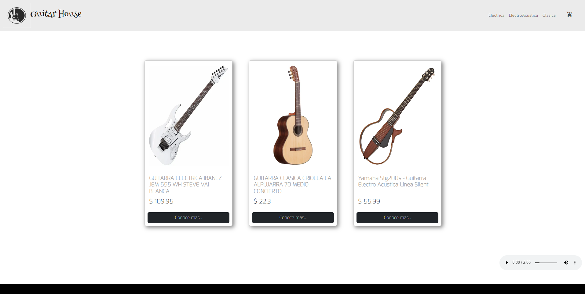

# E-comerce React

This project is for coderHouse React course, it's an e-commerce for guitars




### `link demo :` 

This project was bootstrapped with [Create React App](https://github.com/facebook/create-react-app).

##  used bookstores

- bootstrap: ^5.2.2
- firebase: ^9.14.0
- react": ^18.2.0,
- react-audio-player: ^0.17.0,
- react-bootstrap: ^2.5.0,
- react-dom: ^18.2.0,
- react-loading-skeleton: ^3.1.0,
- react-router-dom: ^6.4.2,
- react-scripts: 5.0.1,
- react-spinners: ^0.13.6,
- sweetalert: ^2.1.2,

## steps to run the project

### `Clone`
```
 git clone https://github.com/fhpalacioss/GuitarHouse.git
```

### `install dependencies`
```
 npm install 
```

 ### `In the project directory, you can run:`       
```
npm start

Runs the app in the development mode.\
Open [http://localhost:3000](http://localhost:3000) to view it in your browser.

The page will reload when you make changes.\
You may also see any lint errors in the console.
```


